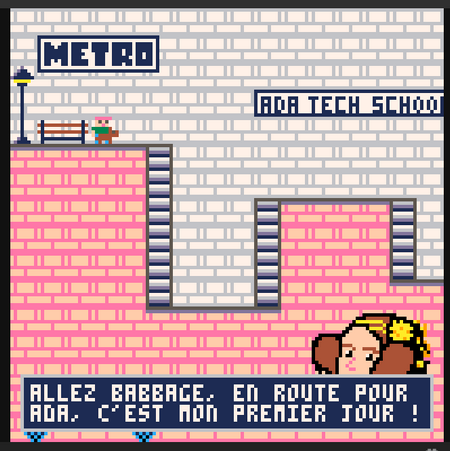
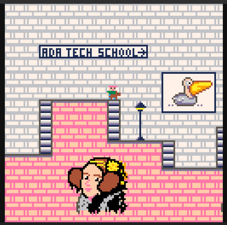

# Woof

Mémorise les bonnes combinaisons de touches pour guider le chien d'assistance Babbage et son maître malvoyant à travers le métro !

## Description

Ce mini-jeu a été développé sur [Pico-8](https://www.lexaloffle.com/pico-8.php), une "fantasy console" qui possède un environnement de développement complet (de l'éditeur de code aux graphismes, en passant par la musique) conçue pour créer, partager et jouer à des mini-jeux.  
👉 Pour jouer à notre jeu en ligne, c'est par [ici](https://www.lexaloffle.com/bbs/?tid=54885) !

_Aperçu :_

## Projet

Ce projet est le tout premier réalisé dans le cadre de l'école Ada Tech School, par un groupe de 3 apprenant·e·s sur une durée de sept jours.

_Objectifs pédagogiques :_
* Acquérir les premières compétences de langages de programmation
* Acquérir les premières compétences du travail en équipe
* Se familiariser avec l'utilisation de Git
* Comprendre un environnement de développement spécifique (gestion de la boucle de jeu, affichage de sprites, gestion des inputs clavier, collisions 2D, camera 2D, gestion des ressources graphiques et sonores...)

## Améliorations envisagées

* Plusieurs niveaux de difficultés
* Avoir un écran d'accueil
